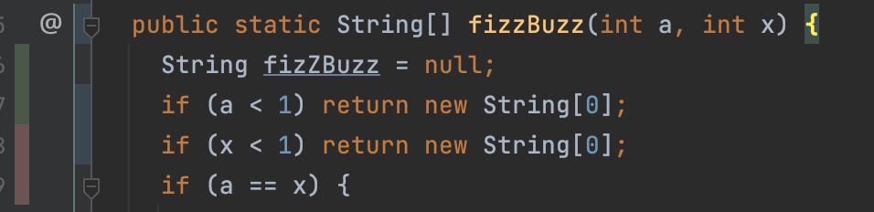

---
# try also 'default' to start simple
theme: seriph
# random image from a curated Unsplash collection by Anthony
# like them? see https://unsplash.com/collections/94734566/slidev

background: /assets/head-in-box.jpg

# apply any windi css classes to the current slide
class: 'text-center'
# https://sli.dev/custom/highlighters.html
highlighter: shiki
# show line numbers in code blocks
lineNumbers: false

# persist drawings in exports and build
drawings:
  persist: false
# use UnoCSS (experimental)
css: unocss
---

# Blind Refactoring

Changing Code You Don't Understand

<div class="abs-br m-6 flex gap-2">
  <a href="https://github.com/kylehoehns/approval-testing-demo" target="_blank" alt="GitHub"
    class="text-xl icon-btn opacity-50 !border-none !hover:text-white">
    <carbon-logo-github />
  </a>
</div>

---
layout: default
---

# The Scenario

<div class="text-left">
    <p>The business needs an enhancement to its legacy FizzBuzz application</p>
    <p v-click="1">...that needs implemented today</p>
    <p v-click="2">...and there aren't any existing tests</p>
    
</div>

---
layout: default
---

# Legacy Code

```java {all|1|3-4|11-13|18|20|all}
public static String[] fizzBuzz(int a, int x) {
  String fizZBuzz = null;
  if (a < 1) return new String[0];
  if (x < 1) return new String[0];
  if (a == x) {
    fizZBuzz = "";
    return new String[]{fizZBuzz};
  } else {
    if (a % 15 == 0) fizZBuzz = "FizzBuzz";
    else {
      if (a % 3 == 0) {
        fizZBuzz = "Fi" + "zz";
      }
      if (a % 5 == 0) {
        fizZBuzz = "Buzz";
      }
    }
    fizZBuzz = fizZBuzz != null ? fizZBuzz : new Integer(a).toString();
  }
  return (fizZBuzz + Arrays.toString(fizzBuzz(a + 1, x)))
      .replaceAll("\\]", "")
      .split("\\[|,\\s*");
}
```

---

# First Step When Working With Legacy Code

<v-click>

```shell
git blame FizzBuzz.java
```

</v-click>

<br />

<v-click>

```shell
740cc984 (Kyle Hoehns 2022-08-04) 1) ...
```

</v-click>

<br />


---

# Real First Step When Working With Legacy Code

## Get Test Coverage
* unit
* component/module
* integration

Without test coverage whatever you decide to change has a very real chance of impacting already happy customers.


---
layout: default
---

# Getting Comprehensive Test Coverage Is Hard


## You need to
* read long and unmanageable methods
* research years of changes to a method
* become an expert in a domain you may not be comfortable with

---
layout: default
---

# Usual Approach

Test inputs and outputs

```java
public static String[] fizzBuzz(int a, int x) {
  String fizZBuzz = null;
  if (a < 1) return new String[0];
  // ...
}
```

```java
@Test
void givenAFizzBuzzStartThatIsLessThan1_whenIExecuteFizzBuzz_thenIShouldGetAnEmptyArray() {
  assertArrayEquals(new String[]{}, fizzBuzz(0, 3));
}
```

<v-click>

</v-click>

---
layout: fact
---

# Mindset
Untested Production Code Has No Errors


---
layout: default
---

# Approval Tests

Don't care about what the code does or the output of your tests. Just add enough tests to get to 100% coverage.

```java
public static String[] fizzBuzz(int a, int x){
  String fizZBuzz=null;
  if(a< 1)return new String[0];
  // ...
}
```

```java
@Test
void testFizzBuzz() {
    Approvals.verifyAll(
      new FizzBuzzTestCase[]{
        new FizzBuzzTestCase(0, 3)
      },
      testCase -> Arrays.toString(
        fizzBuzz(testCase.start, testCase.end)
      )
    );
}

record FizzBuzzTestCase(int start, int end) {}
```

---
layout: default
---

# Output
Running the tests will create a new output file that will contain the output of all the executed test cases.

```text
FizzBuzzTest.testFizzBuzz.received.txt
---
[]
```

Utilizing code coverage while running the tests allows us to see paths through the code we haven't tested yet.



---
layout: default
---

# Get More Coverage

Keep writing as many test cases as you want until you get more test coverage

```java {6-10}
@Test
void testFizzBuzz() {
    Approvals.verifyAll(
      new FizzBuzzTestCase[]{
        new FizzBuzzTestCase(0, 3),
        new FizzBuzzTestCase(10, 0),
        new FizzBuzzTestCase(1, 1),
        new FizzBuzzTestCase(15, 16),
        new FizzBuzzTestCase(1, 4)
      },
      testCase -> Arrays.toString(
        fizzBuzz(testCase.start, testCase.end)
      )
    );
}
```

<v-click>
```text {2-5}
[]
[]
[]
[FizzBuzz]
[1, 2, Fizz]
```
</v-click>

---
layout: default
---

# Implement Changes

With the ApprovalTests framework, rename the output file from *.received.txt to *.approved.txt when you're finished getting coverage. From then on, any tests ran will compare their output against the approved test and show an error if output changed.

With quick and thorough test coverage you can now be confident that your changes will not break existing functionality.

---
layout: default
---

# Links

<ul>
  <li><a href="https://github.com/kylehoehns/approval-testing-demo">Example Code</a></li>
  <li><a href="https://approvaltests.com/">Approval Tests Library</a></li>
</ul>